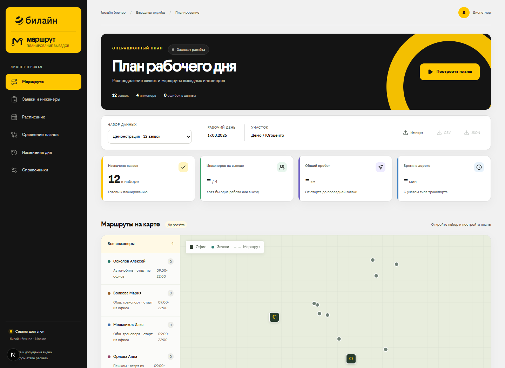

# МАРШРУТ

**Команда «ВСАДНИКИ» · Бизнес №3 «Билайн Бизнес» · ЛЦТ 2026**

[](https://github.com/Nikolai13072004/vsadniki-marshrut-lct-2026/actions/workflows/checks.yml)

Рабочее место диспетчера выездной инженерной службы. Приложение импортирует заявки, строит базовый и оптимизированный планы, показывает карту, расписание и причины назначений, сохраняет версии рабочего дня и экспортирует результат.

Интерфейс конкурсного прототипа оформлен в стилистике «билайн бизнес». Использованные публичные референсы, токены и правила развития компонентов описаны в [визуальной системе](docs/BEELINE_VISUAL_SYSTEM.md).

Сравнение планов показывает долю назначений, пробег и время дороги на назначенную заявку, изменение к левому плану. Это плановые показатели, не подтверждение выполнения работ. Общий пробег нельзя оценивать отдельно от объёма назначений.

## Материалы для жюри

- [Презентация проекта в PDF](docs/presentation/МАРШРУТ_ВСАДНИКИ_ЛЦТ2026_Билайн_Бизнес.pdf)
- [Сценарий проверки прототипа](docs/TESTER_GUIDE.md)
- [Результаты контрольного прогона](docs/QA_REPORT.md)
- [Описание визуальной системы](docs/BEELINE_VISUAL_SYSTEM.md)



Репозиторий содержит финальный конкурсный снимок проекта на основе актуальной версии общего репозитория, коммит `d58124e`.

## Быстрый запуск

Нужен Docker Desktop с запущенным Linux-движком.

```sh
docker compose up --build -d
```

Открыть [приложение](http://localhost:3000). API: [документация OpenAPI](http://localhost:8000/docs), [проверка доступности](http://localhost:8000/api/health).

При первом запуске база наполняется подготовленными наборами. Изменения и планы сохраняются в Docker volume `routing-state`. `docker compose down` останавливает приложение и сохраняет данные. Не используйте `down -v`, если хотите сохранить свою работу.

### Локальный запуск без Docker

Python 3.13+, Node.js 24+.

```sh
python -m venv .venv
.venv\Scripts\python -m pip install -r backend/requirements.txt
.venv\Scripts\python -m uvicorn app.main:app --app-dir backend --host 127.0.0.1 --port 8000
```

Во втором терминале:

```sh
cd frontend
npm ci
npm run dev
```

Windows: `powershell -ExecutionPolicy Bypass -File scripts/start-local.ps1` запускает API в фоне и интерфейс в текущем терминале. Скрипт выводит PID API для остановки.

Для локальной production-сборки вместо `npm run dev` выполните `npm run build`, затем `npm start`. Скрипт старта подготавливает статические ресурсы standalone-сборки. Адрес API задаётся через `API_INTERNAL_URL` **до сборки**, порт интерфейса - через `PORT` при запуске. По умолчанию API - `127.0.0.1:8000`, интерфейс - `127.0.0.1:3000`.

## Основной демонстрационный сценарий

1. Открыть встроенную «Демонстрацию · 12 заявок». Адреса основаны на реальных геокодированных зданиях Югоцентра; окна, профили и требования этого учебного набора явно синтетические.
2. В разделе «Заявки и инженеры» проверить навыки, транспорт, окна и происхождение полей.
3. Нажать «Построить планы». Последовательно вычисляются базовый план и оптимизированный вариант.
4. Над картой посмотреть «Контроль сроков»: неназначенные заявки, начало близко к концу окна и отдельный SLA (если он задан). Это оценка по плану, не отслеживание инженера в реальном времени. Затем выбрать инженера на карте, открыть расписание и карточку работы с объяснением навыка, окна, смены и переезда.
5. В заявках выбрать «Без назначения». Карточка показывает проверенную причину, данные по инженерам и безопасный следующий шаг; одно учебное окно специально сделано недостижимым.
6. В «Сравнении планов» проверить назначения, число инженеров и пробег каждого маршрута. Сверху показан воспроизводимый отчёт по трём полным регионам.
7. В «Изменениях дня» рассчитать срочную заявку в 13:00. Сначала появится несохранённый черновик: сравнение показателей, карта прежних и новых маршрутов и список изменений. «Подтвердить этот план» сохраняет именно показанный вариант, «Оставить прежний план» не меняет историю. Такой же просмотр перед подтверждением есть для недоступности инженера и переноса окна клиента. Обычную новую заявку система пытается вставить только в свободное место, не сдвигая уже выданные назначения. Там же диспетчер может отметить начатую заявку завершённой; завершённая работа останется в истории.
8. Скачать CSV и JSON. JSON содержит полный снимок данных и настроек; его можно импортировать как новый набор.

Отдельно доступны три полных исходных набора: Восток - 66 заявок / 12 инженеров, Юго-восток - 83 / 12, Югоцентр - 56 / 11. Каждый файл принят за отдельный участок обслуживания; точная схема границ участков не предоставлена. В Юго-востоке есть адреса Москвы и Подмосковья.

Региональный отчёт пересчитывается командой `.venv\Scripts\python scripts/region_report.py` из неизменённых подготовленных наборов. Скрипт использует отдельную временную базу, не меняет рабочую историю и сохраняет `data/reports/region_report.json`. В отчёте есть SHA-256 исходного CSV, нормализованного набора и кода алгоритма, настройки, метрики и статус поиска. Базовый алгоритм обрабатывает заявки по порядку строк; это не историческое контрольное распределение.

### Дополнительные сценарии

- Импорт собственного CSV: «Импорт» - кодировка/разделитель - файл - «Инженеры» - «Добавить инженера». Координаты известных адресов подставляются из локального справочника; неизвестные нужно проверить и указать вручную. Ошибки блокируют расчёт, предупреждения не скрываются.
- Статусы, отмена и недоступность: в «Изменениях дня» диспетчер последовательно переводит назначенную заявку через «Отправлена - В пути - Выполнение - Завершена». Этапы нельзя пропускать; выезд закрепляет назначение, начало выполнения исключает заявку из перестановок. Завершённая заявка остаётся в маршруте с фактическим временем отметки. Отмена доступна до начала выполнения и сохраняется в журнале события.
- Ручное назначение: открыть карточку заявки - «Назначить вручную» - инженер/позиция/время. Нарушающее ограничения назначение отклоняется без изменения плана; допустимое можно закрепить для будущих пересчётов.
- Оборудование и мягкий SLA: отдельные настройки и поля карточек. Во встроенных наборах оборудование включено как строгое ограничение и закреплено за инженером на весь день; матрица совместимости относится к дневным комплектам, а не к складским остаткам. При импорте произвольного CSV проверка оборудования остаётся выключенной до заполнения профилей. Риск SLA - запас времени, не предсказанная вероятность.
- Участки и старт: инженер получает заявки только своего участка, в том числе при ручном назначении. Географические районы внутри участка могут различаться. В профиле инженера можно выбрать старт из офиса, из дома или из указанной точки; карта и расписание показывают фактическую стартовую точку.
- История и сравнение: выбрать любые две версии. «Тщательный вариант» увеличивает число рассматриваемых решений; иной или лучший результат не гарантируется. Различия входных данных явно отмечаются.

## Данные и происхождение

`data/raw` содержит побайтовые копии шести CSV. `data/sources.json` содержит SHA-256 и контрольные количества. Исходные файлы рядом с проектом не используются для записей. `scripts/verify_sources.py` проверяет и копии, и оригиналы, если они доступны.

Поддерживаются CP1251, UTF-8, UTF-8 BOM, `;` и `,`; до 150 заявок в одном наборе. Пустые строки пропускаются. Строка адреса офиса выделяется отдельно. Исходные ID, адреса и статус BK сохраняются; внутренний ID включает строку, поэтому повтор `305898293` в контрольном файле Юго-востока не теряется. Повторяющиеся адреса не объединяются. Выполненные и отменённые статусы из CSV показываются как историческая справка и не фильтруют новый план автоматически.

Синтетические CSV являются планируемыми наборами. Контрольные файлы дают названия бригад и историческую справку. Их статусы не считаются состоянием нового смоделированного дня, а назначения не используются как математический эталон.

Происхождение значений: `provided` - исходник, `computed` - вычислено, `configured` - настройка, `synthetic` - учебное дополнение. Редактирование выполняется в нормализованном слое. Снимки планов неизменны; новая правка данных требует нового расчёта.

## Данные постановщика и допущения раздела 15

- Нет справочника инженеров: названия из контрольных CSV, отдельно генерируемые профили навыков, транспорта и смен. Начальная смена 09:00-22:00 - редактируемое допущение прототипа. Куратор 29.09 уточнил: график задаётся каждой бригаде отдельно; для 5/2 допустимы 09:00-18:00, для 2/2 ориентир 10:00-22:00. Эти пресеты доступны в профиле инженера, часы можно исправить вручную. Календарь чередования смен не моделируется в однодневном расчёте.
- Полные нормативы получены 16.09.2026: Подключение 90, Глобальная проблема 100, Дозаказ 40, Локальная заявка 50 минут. Уточнение куратора: в каждом нормативе уже есть 20 минут дороги до ТКД. Поэтому основной режим использует 70/80/20/30 минут работы и отдельно рассчитанную дорогу по маршруту - без двойного учёта. Полные нормативы сохранены в справочнике и доступны как сценарный режим сравнения.
- Нет навыков: BK `Локальная заявка` - local, `Подключение` и `Дозаказ` - connection, `Глобальная проблема` - emergency.
- Авария определяется только значением `Авария` в поле HD (`request_type_hd`, «Тип заявки HD»). Категория BK `Глобальная проблема` сама по себе не делает заявку аварийной. Срочность, явно выставленная диспетчером, остаётся отдельным приоритетом.
- Нет справочника транспорта: четыре типа в профилях, с преобладанием общественного транспорта; каждой двенадцатой исходной заявке задано синтетическое требование автомобиля. Требования редактируются отдельно.
- Нет официального справочника оборудования: каталог, требования заявки и фактический дневной комплект инженера редактируются отдельно. Для подготовленных наборов комплекты сгенерированы из синтетических профилей и явно помечены; у собственного импорта проверка включается после настройки матрицы и комплектов.
- Временное окно официально ограничивает начало работы; завершение может быть позже конца окна, но не позже конца смены. Дополнительное поле `sla_deadline` остаётся необязательным расширением.
- Нет координат: подготовка заранее, сохранение результата и качества. Неполученные координаты блокируют расчёт и допускают ручное исправление.
- Воспроизводимый шаблон срочной аварии создаётся на адрес офиса с 80 минутами технической работы: остальные 20 минут полного норматива относятся к дороге. Демонстрационное окно реакции - 120 минут; параметры остаются редактируемыми.
- Эксперты разрешили считать аварии из CSV известными к начальному расчёту либо вводить их как события в течение дня. Мы используем оба сценария; для события окно реакции отсчитывается от его времени поступления. Около 20 участков на Москву и область - ориентир, не ограничение размера входного набора.

Обязательные правила: маршрут начинается в стартовой точке; возврат после последней работы не требуется. Время - целые минуты рабочего дня `dataset.date`, Europe/Moscow; в UI - ЧЧ:ММ. Внутри алгоритма расстояния - целые метры, в UI - километры.

## Алгоритмы и архитектура

Next.js/TypeScript - FastAPI/Pydantic - сервис матриц - базовое планирование или Google OR-Tools - независимая проверка плана - SQLite.

Базовый алгоритм обрабатывает заявки ровно в порядке CSV, добавляет каждую в конец маршрута первого допустимого инженера. Он не переставляет уже назначенные работы.

OR-Tools решает VRPTW с индивидуальными стартами, временем обслуживания, ожиданием, окнами начала, сменами и ресурсами. Приоритеты: число назначений - число задействованных инженеров - аварии - подключения - пробег - стабильность и мягкие SLA-штрафы. Ремонт и дозаказ находятся на третьем уровне предметного приоритета. Первые два критерия следуют ответу постановщика от 16.09.2026, порядок типов работ - уточнению куратора от 19.09.2026. Доминирующие веса рассчитываются по верхним границам конкретного набора и проверяются на переполнение. Лучший допустимый базовый результат сохраняется, если найденный оптимизатором вариант хуже. Математическая оптимальность не заявляется.

Используются один поток поиска, фиксированный seed и ограничение количества решений. Лимит времени - аварийная граница; достигнутый лимит отмечается в плане. Идентичные снимки данных/настроек повторно используют сохранённый результат. На разных платформах пограничный поиск по времени может остановиться на разных допустимых решениях.

При событии начатый переезд и связанная с ним работа замораживаются целиком до завершения: диспетчер не переназначает заявку, когда инженер уже выехал. После текущей работы маршрут можно перестроить. Уже выполненные переезды сохраняются. Если статус движения не был зафиксирован вручную, состояние выводится из времени плана; это модель, не GPS-измерение.

Причины неназначения содержат проверку ресурсов, одиночной достижимости и возможности вставки в текущие маршруты. Если допустимая вставка существует, сервис сообщает ограничение поиска, а не заявляет, что заявка математически невозможна.

## Карта и маршрутизация

Автономный режим по умолчанию: Haversine × 1.3; скорости автомобиль 30, пешком 5, велосипед 15, общественный транспорт 20 км/ч. Все значения редактируются. Для общественного транспорта используется средняя скорость, а не расписание движения; прогноз пробок заранее не моделируется. Линии на карте показывают порядок посещения, а не дорожную геометрию. Подложка OpenStreetMap требует сети, но её отсутствие не блокирует точки, таблицы и расчёт.

Опциональный адаптер OSRM использует `OSRM_URL`, кеширует матрицу и переходит к оценке при отказе. OSRM применяется только к автомобильному профилю; остальные виды транспорта используют явно подписанную оценку. Встроенный демонстрационный сценарий не вызывает внешнее геокодирование.

Геоданные: © OpenStreetMap contributors, ODbL. Разовая подготовка через Nominatim соблюдает [политику использования](https://operations.osmfoundation.org/policies/nominatim/): один поток, пауза 1.1 секунды, кеш всех ответов, только обезличенные адреса зданий. Скрипты подготовки не запускаются приложением автоматически.

## API

- `GET /api/datasets`, `GET /api/datasets/{id}` - наборы и результаты проверки.
- `POST /api/datasets/import` - multipart CSV/JSON до 5 МБ, необязательные `encoding` и `delimiter`.
- `PATCH /api/datasets/{id}` - нормализованные заявки, инженеры и настройки с проверкой номера `revision`.
- `POST /api/plans/baseline`, `POST /api/plans/optimize` - `{dataset_id, settings?, variant?}`.
- `GET /api/plans?dataset_id=...`, `GET /api/plans/{id}` - история и снимок результата.
- `POST /api/plans/{id}/events` - событие с временем и данными.
- `POST /api/plans/{id}/events/preview` - расчёт черновика без записи в историю; `POST /api/plans/{id}/events/confirm` с `preview_id` сохраняет ровно этот план. Срочная заявка, недоступность инженера и перенос окна клиента проходят этот предварительный просмотр. Черновик действует 30 минут и отклоняется, если набор изменился.
- `POST /api/plans/{id}/manual` - проверенное ручное назначение и необязательная фиксация. Для инженера вне состава рабочего дня нужен явный `activate_engineer=true`; отдельный вызов записывается в событие и не снимает ресурсные ограничения.

План сохраняет `working_engineer_ids`: состав первоначально задействованных инженеров и явно подтверждённых вызовов. Автоматические события не подключают остальных инженеров. Отмена последней заявки не удаляет инженера из состава дня. Старый план без этого поля получает состав по имеющимся маршрутам при следующем пересчёте; для чистого сценария с новым правилом нужно построить новый первоначальный план.
- `GET /api/reports/regions` - проверенный по хешам отчёт на трёх подготовленных регионах.
- `GET /api/plans/{id}/compare?other_id=...` - сравнение с выбранным планом или родителем.
- `GET /api/plans/{id}/export?format=csv|json` - экспорт.

Точная схема всех полей доступна в OpenAPI. Нет авторизации: прототип привязан к loopback и предназначен для локальной работы. Файлы проверяются по расширению, размеру и структуре; ошибки не содержат внутренних путей. CSV-экспорт экранирует формулы.

Интерфейс отклоняет чужие `Host`, API - записи с чужим браузерным `Origin`. Это дополнительная защита локальной версии, не замена авторизации. Нельзя публиковать её через туннель или reverse proxy как многопользовательский сервис без отдельной подготовки.

## Проверки

```sh
.venv\Scripts\python -m pytest -q
.venv\Scripts\python -m ruff check backend scripts
.venv\Scripts\python -m ruff format --check backend scripts
.venv\Scripts\python scripts/verify_sources.py
cd frontend
npm run typecheck
npm run format:check
npm run build
npx playwright install chromium firefox
npm run test:e2e
```

E2E требуют запущенное приложение на порту 3000; другой адрес задаётся переменной `APP_URL`. Они создают тестовые наборы и планы в выбранной БД: для изолированного прогона используйте отдельную БД/Compose volume. Чужие наборы тесты не удаляют. Проверяются Chromium, Firefox и установленный Edge. Отчёт - `frontend/playwright-report`; снимки - `frontend/output/playwright`.

Результаты контрольного прогона и оставшиеся ограничения: [QA_REPORT.md](docs/QA_REPORT.md).

Для проверки на другом компьютере используйте [гайд тестера](docs/TESTER_GUIDE.md).

### Поддержка кода

Сервер разделён на модели данных, импорт, хранение, матрицы переездов, планирование и события. Во фронтенде `Workspace` координирует состояние и запросы, `PlanningSettings` редактирует черновик настроек, формы ресурсов и событий находятся в `AdvancedControls`, карта - в `RouteMap`. Сохранение настроек и проверка ревизии не дублируются внутри панели.

Форматирование воспроизводимо: Python - `ruff format backend scripts`, фронтенд - `npm run format`. Проверки `--check` включены в локально подготовленный CI. Комментарии поясняют ограничения алгоритма и нетривиальные причины решений. При изменении правил назначения сначала добавляйте проверку соответствующего ограничения; визуальный рефакторинг должен сохранять сквозные сценарии.

## Резервное копирование и восстановление

Не копируйте только работающий файл SQLite обычной командой: последние транзакции могут находиться в WAL. `scripts/backup_database.py` использует SQLite Backup API, проверяет целостность и отказывается перезаписывать существующий файл.

```powershell
# Из корня проекта, выберите новое имя резервной копии.
.\.venv\Scripts\python.exe scripts/backup_database.py output/routing.sqlite output/backups/manual-20260915.sqlite

# Для Docker-базы; имя также должно быть новым.
docker compose exec -T api python /app/scripts/backup_database.py /state/routing.sqlite /state/backups/manual-20260915.sqlite
docker compose cp api:/state/backups/manual-20260915.sqlite ./output/backups/manual-20260915-docker.sqlite
```

Перед `docker compose cp` создайте локальную папку `output/backups` и убедитесь, что файл назначения отсутствует. Сам `docker compose cp` не защищает от перезаписи.

Восстановление без удаления старой БД: остановите API, сделайте из резервной копии новый рабочий файл тем же скриптом и укажите его в `DATABASE_PATH`. В Docker скопируйте новый файл в `/state` и смените `DATABASE_PATH` в `compose.yaml`, затем выполните `docker compose up -d --force-recreate api web`. Предыдущий файл оставьте до проверки истории и планов. Не используйте `down -v`.

## Границы

Прототип рассчитан на один день, максимум 150 заявок и 15 инженеров на набор. Нет мобильного приложения, авторизации, FSM, GPS, Kafka или промышленного мониторинга. Само приложение работает локально и не опубликовано как сайт.
